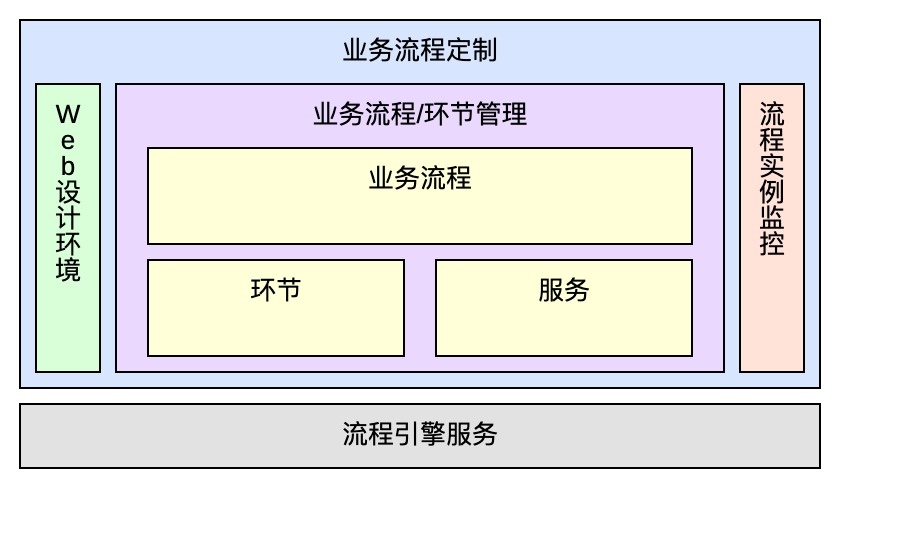

# iBPM(AI Business Process Management)概览
## 一、简介
​		iBPM是一个基于Java实现的分布式业务流程管理产品，负责对业务流程整个生命周期的管理，包括业务流程的设计、建模、部署、运行、监控、管理。iBPM由业务流程定制和流程引擎服务两部分组成。遵从WFMC参考模型的流程平台产品。以下是iBPM和部分工作流产品的对比：
|产品维度|iBPM|JBPM|Enhydra Shark|OSWorkflow|BPM|Activity|
| ---- | ---- | ---- | ---- | ---- | ---- | ---- |
|开发公司|亚信|JBoss|Together|Opensymphony|普元|Alfresco|
|标签语言| 自定义 | BPMN2.0 | XPDL | XPDL | 自定义 | BPMN2/xPDL/jPDL |

----

## 二、产品功能及特性
### 1、产品功能
​		iBPM主要功能包含业务流程定制和流程引擎服务两大部分，其中业务流程定制包含Web设计环境等五个模块：
- **Web设计环境：**用于设计、管理可视化的业务流程
- **实例监控：**用于对流程实例进行监控（执行时间、执行环节等信息）
- **业务流程：**业务流程是一组将输入转化为输出的相互关联或相互作用的活动
- **环节(活动)：**流程中的节点，主要包括：java方法、逻辑判断以及子流程
- **服务：**提供给活动环节执行的代码服务
- **流程引擎：**对业务流程的流转进行调度和监控
  
  iBPM功能架构图如下所示：
  
