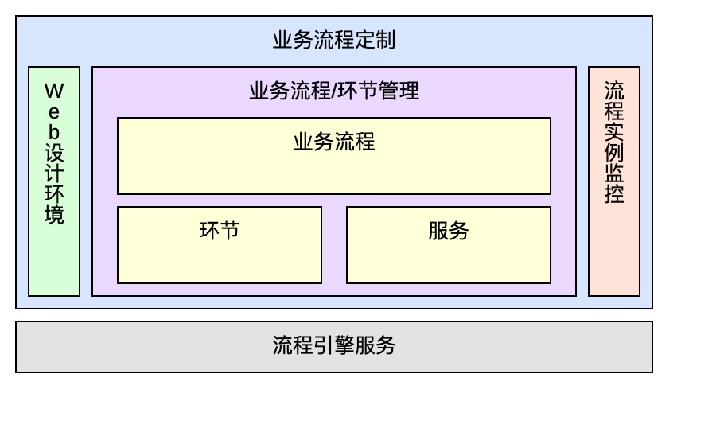
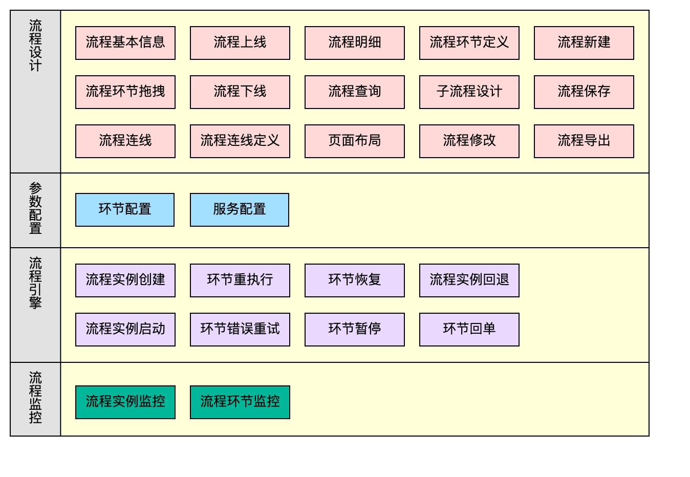
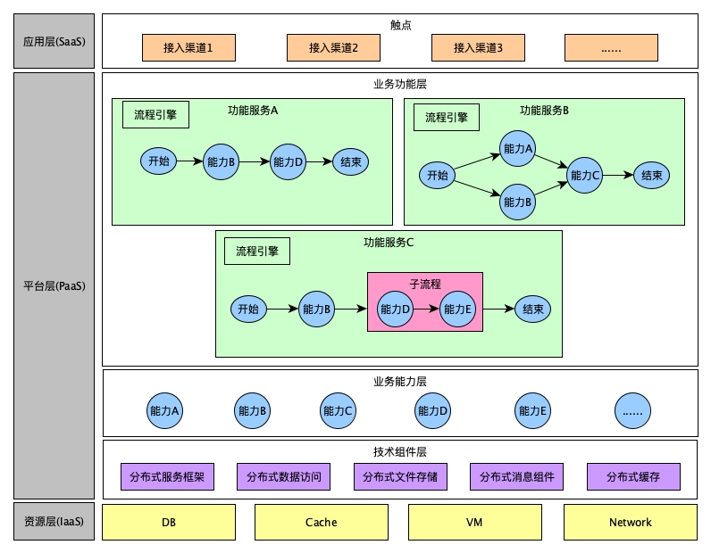

# iBPM(AI Business Process Management)概览
## 一、简介
​		iBPM是一个基于Java实现的分布式业务流程管理产品，负责对业务流程整个生命周期的管理，包括业务流程的设计、建模、部署、运行、监控、管理。iBPM由业务流程定制和流程引擎服务两部分组成。遵从WFMC参考模型的流程平台产品。以下是iBPM和部分工作流产品的对比：
|产品维度|iBPM|JBPM|Enhydra Shark|OSWorkflow|BPM|Activity|
| ---- | ---- | ---- | ---- | ---- | ---- | ---- |
|开发公司|亚信|JBoss|Together|Opensymphony|普元|Alfresco|
|标签语言| 自定义 | BPMN2.0 | XPDL | XPDL | 自定义 | BPMN2/xPDL/jPDL |
|回退| 支持 | 不支持 | 不支持 | 不支持 | 支持 | 支持 |
|监控| 支持 | 支持 | 支持 | 不支持 | 支持 | 支持 |
|图形化设计| 支持 | 支持 | 支持 | 不支持 | 支持 | 支持 |
|集群部署| 支持 | 支持 | 支持 | 支持 | 支持 | 支持 |
|复杂程度| 简易，最轻量级 | 轻量级 | 轻量级 | 简易，最轻量级 | 轻量级 | 轻量级 |
|灵活性/扩展性| 灵活，易于扩展 | 易于扩展 | 易于扩展 | 灵活，易于扩展 | 易于扩展 | 易于扩展 |
|灵活性/扩展性| 非常好 | 一般 | 一般 | 非常好 | 非常好 | 良好 |
|规则引擎支持| 可以选择集成qlexpress | 集成Drools,但性能一般 | 不支持 | 不支持 | 集成普元规则引擎 | 可以选择集成Drools |
|规则引擎| 简单易学 | 版本延续性较差 | 易于学习 | 学习难度高 | 易于学习，部署复杂 | 易于学习 |
|收费情况| 捆绑亚信商业软件开源 | 版本免费，咨询收费 | 社区版免费，商业版收费 | 开源 | 收费 | 开源 |
|售后支持| 亚信 | 社区 | 社区，收费版客服 | 社区 | 收费 | 社区 |

----

## 二、产品功能及特性
### 1、产品功能
​		iBPM主要功能包含业务流程定制和流程引擎服务两大部分，其中业务流程定制包含Web设计环境等五个模块：
- **Web设计环境：**用于设计、管理可视化的业务流程
- **实例监控：**用于对流程实例进行监控（执行时间、执行环节等信息）
- **业务流程：**业务流程是一组将输入转化为输出的相互关联或相互作用的活动
- **环节(活动)：**流程中的节点，主要包括：java方法、逻辑判断以及子流程
- **服务：**提供给活动环节执行的代码服务
- **流程引擎：**对业务流程的流转进行调度和监控
  <!--  -->
   
  iBPM功能架构图如下所示：
  <!--  -->
   

### 2、产品特性
- **流程热部署**
    iBPM流程引擎部署支持jar内嵌到应用集群和单独部署成服务集群两种模式，发布流程或修改流程服务无须重启即可生效。
- **流程分类**
    iBPM支持长流程(人工)、短流程(自动)、子流程三种类型的流程。支持流程的分支、聚合、路由判断。同时流程设计管理界面可建立不同的目录对流程进行分类管理，在具有众多流程的大型项目中使流程管理更加清晰有条理。
- **流程持久化**
    具备数据库(Mysql/Oracle)和XML文件两种持久化流程模板及流程实例的能力，适应不同的版本管理需求。其中采用数据库进行持久化时支持分库分表存储。
- **服务集成**
    提供Dubbo、HSF、Rest等主流服务的集成能力，可在联通天宫环境和非天宫环境集成运行。
- **流程监控**
    提供流程实例的全生命周期监控，可根据性能需要，裁剪合适的监控指标。
- **流程分水岭**
    iBPM流程”分水岭”是指在同一时刻同一个流程可以有不同版本的实例在运行，这对于业务流程经常变更的情况尤为重要。
- **多分支节点并发**
    流程多分支节点并发指的是短流程上如果有多分支都要执行的情况下利用线程池使得符合条件的环节并发执行，当需要并发的环节大于线程池设置的阀值时，则剩余的节点将不再并行。多分支节点并发执行在某些场景下能极大的提高业务流程执行效率和吞吐量。

----

## 三、应用场景
​		iBPM用于对提供的原子功能方法(服务)需要组合并且有一定的顺序才能完成业务流程的场景。如电信业务中的开户流程，需要先在订单系统生成订单后才能到省份OSS系统中进行开通，开通完成后才能进行资料的归档。iBPM在应用中的位置如下,其中流程引擎主要是将业务能力层的服务组合起来提供给接触层使用：
  <!--  -->
   
​		iBPM支持长流程、短流程、子流程三种类型的流程，其中
- **长流程：**主要用于整个业务处理过程需多个环节，且环节中有系统自动处理又有人工干预的环节；比如业务中台订单的处理，如：订单审核、写卡、备货、物流揽收等；资源的调拨、审核；产商品配置的上架、审核、发布；OA系统的申请、多级审核等。
- **短流程：**整个业务处理过程全是自动节点，无需人工干预；比如订单接收过程中的规则校验，包括但不限于：黑名单、实名制、一证五户等。
- **子流程：**应用于复杂的业务场景，可以将关联紧密、相对独立或重复性较高的的业务逻辑划分为一个子流程，供其他流程调用。例如订单接收过程是一个流程，其中的规则校验(黑名单、实名制、一证五户等)因多种订单接收流程都会含有此部分校验，则可将其独立设计为一个子流程。

----

## 四、License
​		iBPM遵循Apache-2.0协议。